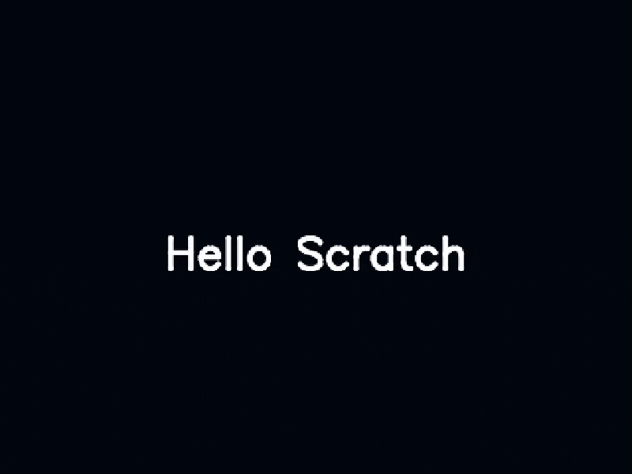

# Quick Start Guide
## Install
1. Install [NodeJS](https://nodejs.org/en)
1. Clone this repo and `cd` into it
1. run `npm install` to install dependencies
1. run `npm link` so you can run the program from the command line

## Hello Scratch

### 1. Create "hello_world.sw"
Create a new folder for the project and create a file called "hello_world.sw" in your text editor. Copy and Paste the program:
```js
show();
goto(0,0);
say("hello world");
```
### 2. Compile it!
Navigate to your project folder in a new terminal/powershell window and enter:
```sh
sw3 build hello_world.sw
```
You should see `"out/hello_world.sb3"` and `out/hello_world.html`
```
current_folder
  |- hello_world.sw            <-- Source File
  |- out
      |- hello_world.sb3       <-- Scratch 3 File
      |- hello_world.html      <-- Bundled Project Player
```

### 3. Run "hello_world.html" in your browser
Copy the full path for `hello_world.html` and paste it into a browser. You should see your project start playing. When you make any changes to your project you can run the build command and reload this page to try them out. You can also use the `watch` command to automatically build your project when changes are detected.

### 4. Upload "hello_world.sb3" to Scratch
Now that we have confirmed our project runs correctly, we can upload it to Scratch. Create a new project and select `File > Load from your computer` then navigate to `hello_world.sb3` and select it.


## Upgrading Hello Scratch
We will need to use some built-in modules. Copy and Paste this code into your "hello_world.sw" file.
```js
import "text" as text;
import "color" as color;
import "graphics" as graphics;
import "window" as window;
```
Next, let's create a function "frame" and tell scratch we want to use it to draw frames with the pen.
```js
function frame(delta_time, events) {
    // draw each frame here
}

window.start(frame);
```

We can update the frame() function to clear the screen with a solid color and draw the text "Hello World".
```js
function frame(delta_time, events) {
    // clear the screen
    graphics.fill_rgb(2,8,16);

    // draw "hello world"
    set_pen_color(color.WHITE);
    set_pen_size(4);
    let x = 0;
    let y = 0 + 12 * sin(timer() * 60);
    text.draw("Hello Scratch", x, y, text.CENTER, text.CENTER, 24, 1);
}
```

## Final Program
You `hello_world.sw` file should now look like this.
```js
import "text" as text;
import "color" as color;
import "graphics" as graphics;
import "window" as window;

function frame(delta_time, events) {
    // clear the screen
    graphics.fill_rgb(2,8,16);

    // draw "hello world"
    set_pen_color(color.WHITE);
    set_pen_size(4);
    let x = 0;
    let y = 0 + 12 * sin(timer() * 60);
    text.draw("Hello Scratch", x, y, text.CENTER, text.CENTER, 24, 1);
}

window.start(frame);
```
Open the HTML or SB3 file to run the program. [Example](./examples/hello_scratch.md)
