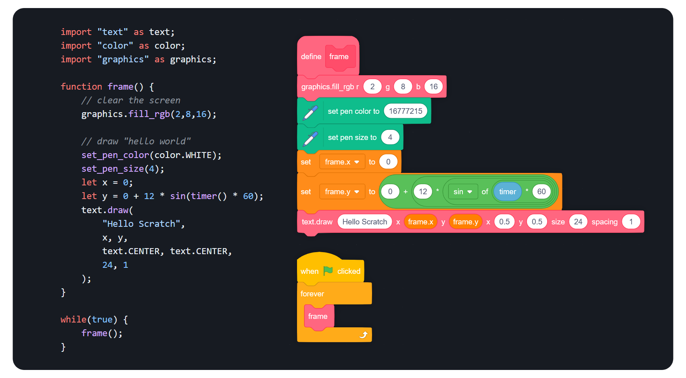

<h1 align="center">
  <br>
  
  <br>
  <br> 
</h1>

> Compile JavaScript-like code to project files for [scratch.mit.edu](https://scratch.mit.edu).



> Check out the [Quick Start Guide](./docs/quick_start.md) to get started with ScratchWriter!

# 🗒️ Table of Contents ➡️ [Quick Start Guide](./docs/quick_start.md) 
### **[Documentation](./readme.md)**
- **[Quick Start Guide](./docs/quick_start.md)**
  - **[Hello Scratch](./docs/examples/hello_scratch.md)**
  - **[Examples](https://github.com/ScratchWriter/sw_examples/tree/main)**
- **[Installing](#installing)**
- **[Syntax](./docs/syntax.md)**
  - **[Variables & Lists](./docs/syntax.md/#variables--lists)**
  - **[Control](./docs/syntax.md/#control-statements)**
  - **[Functions](./docs/syntax.md/#functions)**
  - **[Modules](./docs/syntax.md/#modules--assets)**
- **[Builtin Functions & Blocks](./docs/builtin.md)**
- **[Lists](./docs/lists.md)**
- **[Troubleshooting & Quirks Guide](./docs/troubleshooting.md)**
- **[Standard Modules](./docs/modules/index.md)**
  - **[List](./docs/modules/list.md)**
  - **[String](./docs/modules/string.md)**
  - **[Math](./docs/modules/math.md)**
  - **[Graphics](./docs/modules/graphics.md)**
  - ... and more
- **[Compiler](#cli-usage)**
  - **[Packages](./docs/packages.md)**
  - **[CLI Usage](#cli-usage)**

# Installing
1. Install [NodeJS](https://nodejs.org/en)
1. Clone this repo and `cd` into it
1. `npm install`
1. `npm link`

# CLI Usage
### Example
```sh
sw3 build ./src/main.sw --out-dir ./out/ --out-name my_project
```
### Commands
| Name     | Command               | Description     |
| -------- | --------------------- | --------------- |
| Help     | `sw3 -h`              | print help      |
| Build    | `sw3 build <input>`   | build a project |
| Watch    | `sw3 watch <input>`   | build a project when changes are detected in its directory |

### Targets
| Target            | ext                  |  Option             | Default | Description |
| :---------------: | :------------------: | ------------------- | :-----: | ----------- |
| Scratch 3         | `.sb3`               | `--target-sb3`      | Yes     | Normal Scratch3 File. |
| HTML Package      | `.html`              | `--target-html`     | Yes     | Package Program into an HTML file with TurboWarp. |
| project blocks    | `.blocks.json`       | `--target-blocks`   | No      | Streamlined project.json for debugging. |
| project.json dump | `.project.json`      | `--target-sb3-json` | No      | Dump the contents of the project.json file. |

# Building
You will need:
- NodeJS

Steps:
- Clone this repo
- Run `npm install`
- Run `npm run build`
- If you want to use the version of the project you built you may want to run `npm link` to make the command available and allow other projects to import it.

### Disclaimer
This program comes with ABSOLUTELY NO WARRANTY, to the extent permitted by applicable law. DO NOT COMPILE / USE PROGRAMS FROM SOURCES YOU DO NOT TRUST. USE AT YOUR OWN RISK.

I only maintain this as a side project. Do not expect everything to be up to date or well documented. When installing, `npm` will probably yell at you about outdated packages. This project runs locally so keeping dependencies up to date isn't a huge priority for me, I try to fix it every once and a while though.
